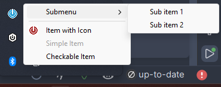

<h1 align="center">
  <br>
  <a href="#">
    
  </a>
  <br>
  CrossTray
  <br>
</h1>

<h4 align="center">A cross-platform .NET library for creating tray icons with customizable context menus.</h4>

<p align="center">
  <a href="#key-features">Key Features</a> •
  <a href="#how-to-use">How To Use</a> •
  <a href="#download">Download</a> •
  <a href="#credits">Credits</a> •
  <a href="#related">Related</a> •
  <a href="#license">License</a>
</p>

## Key Features

* Cross-platform tray icon support
  - Seamless integration with Windows, macOS, and Linux.
* Customizable context menus
  - Support for text, icons, checkable items, separators, and nested submenus.
* Event handling
  - Define actions for left-click, right-click, and double-click events on the tray icon.
* Easy integration
  - Simple API for adding and managing tray icons and context menus.
* Lightweight and efficient
  - Minimal footprint and optimized for performance.

## How To Use

To clone and use this library, you'll need [Git](https://git-scm.com) and [.NET 8.0 SDK](https://dotnet.microsoft.com/download/dotnet/8.0) installed on your computer. From your command line:

```bash
# Clone this repository
$ git clone https://github.com/xKirtle/CrossTray.git

# Go into the repository
$ cd CrossTray

# Build the library
$ dotnet build

# Reference the library in your project
# (Assuming you have a .NET project set up)
$ dotnet add reference ../crosstray/src/CrossTray/CrossTray.csproj
```

## Sample Code

```csharp
var icon = NotifyIconWrapper.LoadIconFromEmbeddedResource("icon.ico", Assembly.GetExecutingAssembly());
using var notifyIcon = new NotifyIconWrapper("Tooltip name", icon);

var menuItems = new List<ContextMenuItemBase>
{
    new PopupMenuItem("Submenu", new List<ContextMenuItemBase>()
    {
        new SimpleMenuItem("Sub Item 1", item => Console.WriteLine("Sub item 1 clicked!")),
        new SimpleMenuItem("Sub Item 2", item => Console.WriteLine("Sub item 2 clicked!"))
    }),
    new SeparatorMenuItem(),
    new IconMenuItem("Item with Icon", item => Console.WriteLine("Icon item clicked!"), icon),
    new SimpleMenuItem("Simple Item", item => Console.WriteLine("Simple item clicked!")),
    new CheckableMenuItem("Checkable Item", item => Console.WriteLine("Checkable item toggled!"))
};

notifyIcon.CreateContextMenu(menuItems);
notifyIcon.MountIcon();
```
Would result in the following (Windows) tray icon:


## Download
You can download the latest version of CrossTray from the [releases page](https://github.com/xKirtle/CrossTray/releases).

## Credits
This library uses the following open source packages:

 - [.NET](https://dotnet.microsoft.com/)
 - [CsWin32](https://github.com/microsoft/CsWin32)

## License

This project is licensed under the MIT License - see the [LICENSE](LICENSE) file for details.